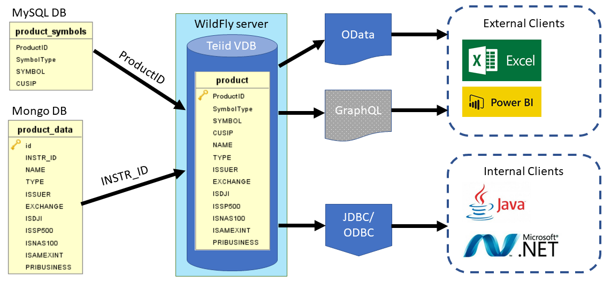

# Teiid Demo Created With Teiid Designer
## Overview
The project created with [Teiid Designer](http://teiid.io/teiid_runtimes/teiid_wildfly/downloads/#teiid-designer) and deployed to [WildFly](http://teiid.io/legacy/downloads_900/) runtime with the following steps:
1. Create source model for `product_symbols` table of MySQL DB
2. Create source model for `product_data` collection of Mongo DB
3. Create view model for `product` which join `product_symbols` and `product_data` with the following SQL statement:
```sql
 SELECT
	a.ProductID, a.SymbolType, a.SYMBOL, a.CUSIP, b.NAME, b.TYPE, b.ISSUER, b.EXCHANGE, b.ISDJI, b.ISSP500, b.ISNAS100, b.ISAMEXINT, b.PRIBUSINESS
 FROM
	Teiid_Demo_MySQL.product_symbols AS a, Teiid_Demo_MongoDB.product_data AS b
 WHERE a.ProductID = b.INSTR_ID
```
4. Create a Virtual DB(VDB) and add the created source models and view model to it
5. Deploy the VDB to WildFly server


As shown in the diagram above, `product_symbols` table of MySQL DB is join with `product_data` collection of Mongo DB with `ProductID` column and `INSTR_ID` field to create a `product` view. The `product` view then exposed as OData API that can be accessed by external clients such as Excel, PowerBI, etc. GraphQL API will be supported in Teiid 13.0 ([TEIID-5674](https://issues.jboss.org/browse/TEIID-5674)). For internal clients such as Java application, .Net application, C++ application, etc. can access the `product` view via JDBC or ODBC connection.

## Tools
 * [Teiid Designer 11.1.2](http://teiid.io/teiid_runtimes/teiid_wildfly/downloads/#teiid-designer) ([User Guide](http://docs.jboss.org/teiid/designer/11.1.2/user-guide/html_single/), [Examples](https://developer.jboss.org/wiki/TeiidDesignerExamples)) 
 * [Teiid WildFly Runtime 9.0.6](http://teiid.io/legacy/downloads_900/)


## Setup and Running 
Start the server with the following command:
```
standalone.sh -c standalone-teiid.xml
```

Before you can connect to Teiid Connection and OData endpoint, you need to create a user with `user,odata` group with the following command
```
add-user.sh
```
Please see the following URL for more information: https://developer.jboss.org/thread/277216

If you would like to create source model from MongoDB collection ([Importer Properties](https://teiid.gitbooks.io/documents/content/reference/MongoDB_Translator.html#_importer_properties)), first you need to install the mongodb JCA module with the following command:
```
jboss-cli.sh -c --file=setup/mongodb.cli
```
Modify the value of `jndi-name`, `RemoteServerList`, `Database` specific to your MongoDB instance.
You can find out more information from https://github.com/teiid/teiid-wildfly-quickstarts/tree/master/mongodb-as-a-datasource

## OData Endpoint
Access the metadata of the VDB with the following URL:
```
http://localhost:8080/odata/TeiidVDB/$metadata
```

Access the data of product view model in JSON format with the following URL:
```
http://localhost:8080/odata/TeiidVDB/Teiid_Demo.product?$format=json
```
__Note:__ View model need to have primary key defined in order to expose it as OData entity, please goto the URL for more information https://developer.jboss.org/thread/243737